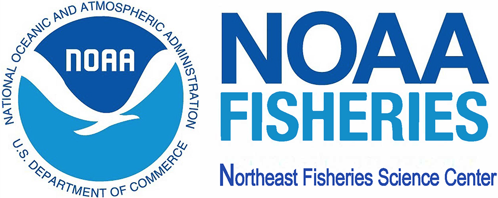

# Survey Simulation Experimentation and Evaluation Project (SSEEP) {#welcome}

Check for GH action...

The **Survey Simulation Experimentation and Evaluation Project (SSEEP)** is a CINAR-funded multi-institutional partnership project, led by Dr. Gavin Fay at the University of Massachusetts Dartmouth School for Marine Science and Technology as part of a BOEM-NOAA interagency agreement to develop a strategy for mitigating the effects of offshore wind energy development on NOAA Fisheries scientific surveys.

Begun in 2021, and focusing on the Northeast Fisheries Science Center's Bottom Trawl Surveys, SSEEP will use a participatory design approach to develop and apply a simulation modeling framework to quantify the likely impacts to NEFSC bottom trawl surveys and data products resulting from interactions with offshore wind development areas, and to evaluate through the simulation how these impacts can be mitigated to maintain data streams that inform best available science for fisheries and ecosystem decision-making. The modeling work is being guided through a series of stakeholder workshops and engagement with an expert Steering Committee.

See the **Project Overview** for more description of SSEEP, learn about the **Project Team**, and the year 1 **Stakeholder Workshops**.

------------------------------------------------------------------------

{width="437"}

{width="131"}

{width="181"}

{width="180"}

{width="184"}
